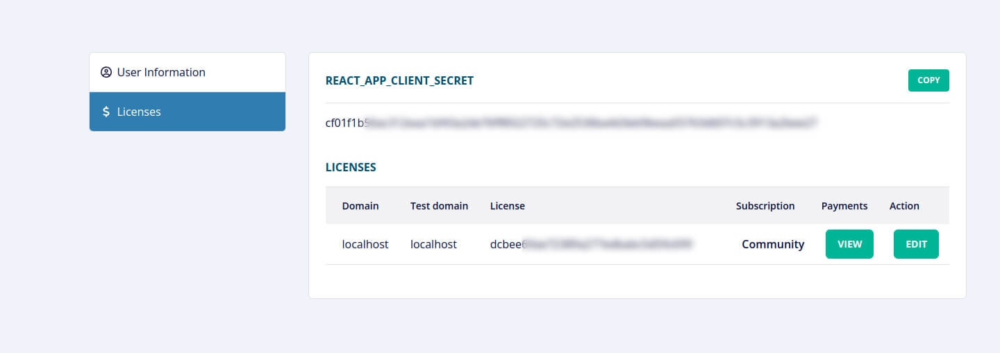
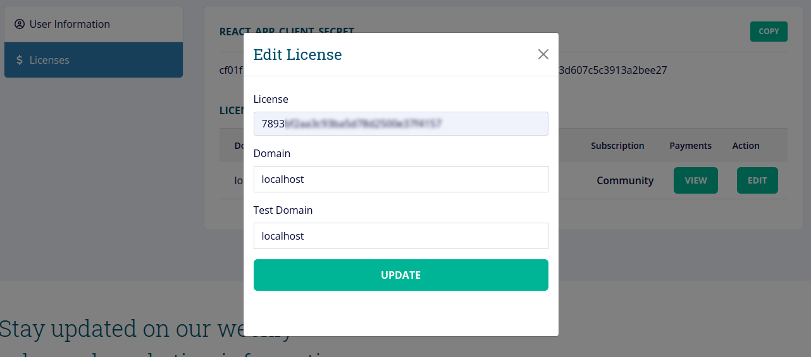

# AesirX DAM

## About

AesirX DAM is our Open-Source PWA-powered enterprise-level Digital Asset Management as a Service (DAMaaS) Solution

Find out more in [https://dam.aesirx.io](https://dam.aesirx.io)

## Development setup

### Configure

1. Register your account at https://dam.aesirx.io/. You will then get an email for user creation account.
2. Activate your account by clicking verify in the email.
3. Login to https://dam.aesirx.io/ site to get the REACT_APP_CLIENT_SECRET and REACT_APP_LICENSE in your profile.
  
  If you don't have any license, select one from our homepage.
  
4. Enter domain and test domain of license. For example:
  
5. At dam-app folder, rename the .env.dist file to .env
    Or use this command:
    ### `mv .env.dist .env`
6. Replace the REACT_APP_CLIENT_SECRET  and REACT_APP_LICENSE in the .env file with the one provided in your profile account.
### `yarn install`
### `yarn dev`

Runs the app in the development mode.
Open [http://localhost:3000](http://localhost:3000) to view it in the browser.

### `yarn build`

Get a full build and install it in your favorite web server.


## Dockerize

#### Production
`docker compose -f "docker-compose.yml" up -d --build`


## Integrate use

The easiest way to use aesirx-dam-app is to install it from npm and build it into your app with Webpack.

```
npm install aesirx-dam-app
```

Add your `REACT_APP_DAM_LICENSE` to your integrate app you get if from #configure step


Then use it in your app:

```js
import React, { useState } from 'react';

import { AesirXDam } from 'aesirx-dam-app';
import { AesirXDamStorage } from 'aesirx-dam-app';

import 'aesirx-dam-app/dist/index.css';
import 'aesirx-dam-app/dist/app.css';

function AesirXDam() {
  const onSelect = (data) => {
    // do something when user onDoubleClick at on that assets
  };

  return (
    <div className="py-4 px-3 h-100 flex-direction-column">
      <div className="h-100 flex-1">
        <AesirXDam onSelect={onSelect} lang={'your_lang_code'} theme={'your_theme'} />
      </div>
      <div>
       <AesirXDamStorage />
      </div>
    </div>
  );
}

export default AesirXDam;

```

## Props

Common props you may want to specify include:

- `onSelect` - subscribe to select event
- `lang` - lang code
- `theme` - light or dark property